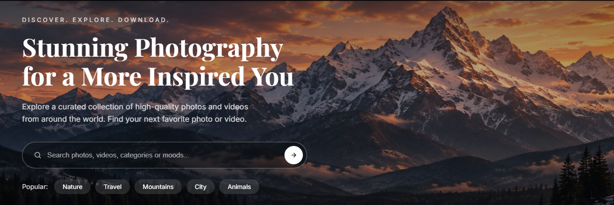

<div align="center">

# 📸 P I X O R A

### Visual Discovery • Photography • Video • Exploration

**Discover. Explore. Download.**

A modern visual discovery platform bringing curated photography and cinematic video together in one immersive, responsive experience.

<br>

[](https://muhammadabdullahkhan11may.github.io/Pixora/)
[](https://github.com/MuhammadAbdullahKhan11may/Pixora)


<br>

**HTML5 · CSS3 · JavaScript · Responsive Web Design · GitHub Pages**

<br>

[Live Experience](https://muhammadabdullahkhan11may.github.io/Pixora/) •
[Features](#-core-experience) •
[Gallery](#-interface-showcase) •
[Architecture](#-frontend-architecture) •
[Run Locally](#-running-pixora-locally)

</div>

---

<p align="center">
  
</p>

<div align="center">

## Stunning Photography for a More Inspired You

Explore curated photography and video from around the world through an interface built around **visual storytelling, discovery, and immersion**.

<br>

[](https://muhammadabdullahkhan11may.github.io/Pixora/)

</div>

---

# ✦ About Pixora

**Pixora** is a responsive photography and video discovery platform designed to make visual exploration feel immersive rather than presenting media through a conventional gallery.

The experience brings together curated photography, trending video, visual categories, search, editorial-style layouts, and dedicated discovery sections within a consistent dark visual identity.

Pixora was developed with a strong focus on:

- 📸 Visual storytelling
- 🎬 Photography and video discovery
- 🌍 Exploration across places and perspectives
- 🖥️ Immersive desktop layouts
- 📱 Responsive interface design
- 🧭 Clear content navigation
- 🎨 Consistent visual identity
- ⚡ Interactive frontend behavior

---

# ✨ Core Experience

<table>
<tr>

<td width="50%" valign="top">

### 📸 Featured Photography

Curated visual stories are presented through large editorial-style cards.

Photography is organized across themes including landscapes, architecture, wildlife, urban environments, astronomy, and travel.

</td>

<td width="50%" valign="top">

### 🎬 Trending Video

A dedicated cinematic section allows visitors to discover trending visual stories.

Video cards combine imagery, category information, location, duration, and playback interactions.

</td>

</tr>

<tr>

<td width="50%" valign="top">

### 🗂️ Category Discovery

Explore visual content through dedicated categories including Nature, Architecture, Wildlife, Travel, Urban, and Ocean.

</td>

<td width="50%" valign="top">

### 🔎 Visual Search

The landing experience introduces search for photos, videos, categories, and moods alongside quick discovery options.

</td>

</tr>

<tr>

<td width="50%" valign="top">

### 🌎 Exploration

Dedicated discovery sections allow visitors to move between photography, video, categories, and visual collections.

</td>

<td width="50%" valign="top">

### 📱 Responsive Experience

The interface is designed to preserve its visual identity while adapting across desktop, tablet, and mobile screen sizes.

</td>

</tr>
</table>

---

# 🖼️ Interface Showcase

## 01 — Why Pixora

<p align="center">
  
</p>

Pixora introduces its visual identity through three central principles:

<div align="center">

### Curated Quality • Diverse Categories • Free to Download

</div>

Large photography, translucent content cards, strong typography, and minimal navigation establish the visual language used throughout the experience.

---

## 02 — Featured Photography

<p align="center">
  
</p>

The Featured section uses an editorial-style layout to showcase visual stories across multiple subjects and locations.

Each photography card combines:

```text
Category
    +
Photography
    +
Story Title
    +
Location
```

The asymmetric grid gives important photographs greater visual weight while keeping supporting stories easily discoverable.

---

## 03 — Trending Video

<p align="center">
  
</p>

Pixora extends beyond static photography with a dedicated cinematic discovery experience.

Video cards surface:

- 🔥 Trending position
- 🗂️ Visual category
- 🎬 Video title
- 📍 Location
- ⏱️ Duration
- ▶️ Playback interaction

This provides a different media experience while maintaining Pixora's overall design language.

---

## 04 — Explore by Category

<p align="center">
  
</p>

Visitors can move from general discovery into interest-based visual categories.

### Categories include

`Nature` · `Architecture` · `Wildlife` · `Travel` · `Urban` · `Ocean`

Large imagery and intentionally varied card dimensions make category navigation part of the visual experience itself.

---

## 05 — Built for Visual Discovery

<p align="center">
  
</p>

The About experience communicates Pixora's central philosophy:

<div align="center">

### BUILT FOR VISUAL DISCOVERY.

</div>

Rather than treating the About section as a simple block of text, Pixora continues the photography-first design language through split-screen composition and large visual storytelling.

---

## 06 — There's More to Discover

<p align="center">
  
</p>

The Explore experience connects the major discovery paths of the platform:

```text
                 EXPLORE
                    │
        ┌───────────┼───────────┐
        │           │           │
        ▼           ▼           ▼
  Photography     Video     Categories
        │                       │
        └───────────┬───────────┘
                    ▼
               Collections
```

The section uses a large cinematic background with direct navigation into each content type.

---

## 07 — Contact & Footer

<p align="center">
  
</p>

The final experience maintains the same visual identity through contact, navigation, social links, support resources, and newsletter elements.

Instead of ending the website with a disconnected generic footer, the final section continues Pixora's visual storytelling.

---

# 🎨 Design System

Pixora uses a restrained interface so the **visual content remains the focal point**.

| Design Area | Approach |
|---|---|
| 🎨 Visual Style | Dark cinematic interface |
| 🖼️ Imagery | Large photography-led compositions |
| 🔤 Typography | Editorial display + clean supporting text |
| 🟡 Accent | Warm/gold navigation highlights |
| 📐 Layout | Editorial grids and asymmetric compositions |
| 🪟 Cards | Image-led and translucent overlays |
| 🧭 Navigation | Persistent minimal navigation |
| 🎬 Media | Photography + cinematic video |
| 📱 Responsiveness | Multi-device layouts |

---

# 🧭 Navigation Structure

Pixora is organized around a visual discovery journey:

```text
                         PIXORA
                            │
       ┌────────────┬───────┼────────┬────────────┐
       │            │       │        │            │
       ▼            ▼       ▼        ▼            ▼
     Home       Featured  Trending Category      About
       │            │       │        │            │
       └────────────┴───────┼────────┴────────────┘
                            │
                            ▼
                         Explore
                            │
              ┌─────────────┼─────────────┐
              │             │             │
              ▼             ▼             ▼
            Photos        Videos      Categories
              │             │             │
              └─────────────┼─────────────┘
                            ▼
                         Contact
```

---

# 🧠 UX Approach

The project follows a **visual-first content hierarchy**.

Instead of giving every interface element equal importance, Pixora uses scale, photography, typography, spacing, and composition to guide attention.

```text
        Hero Experience
              ↓
        Primary Message
              ↓
         Why Pixora
              ↓
    Featured Photography
              ↓
       Trending Media
              ↓
     Category Discovery
              ↓
        Brand Story
              ↓
    Further Exploration
              ↓
           Contact
```

This creates a guided discovery experience rather than a collection of unrelated sections.

---

# ⚙️ Frontend Architecture

Pixora is implemented as a frontend web experience using standard web technologies.

```text
┌─────────────────────────────────┐
│             PIXORA              │
├─────────────────────────────────┤
│                                 │
│             HTML5               │
│                                 │
│      Semantic Structure         │
│      Content Organization       │
│      Page Composition           │
│                                 │
└────────────────┬────────────────┘
                 │
                 ▼
┌─────────────────────────────────┐
│              CSS3               │
│                                 │
│  • Responsive Layouts           │
│  • Grid / Flexbox               │
│  • Typography                   │
│  • Visual Styling               │
│  • Media Queries                │
│  • Image Presentation           │
│                                 │
└────────────────┬────────────────┘
                 │
                 ▼
┌─────────────────────────────────┐
│           JavaScript            │
│                                 │
│  • UI Interaction               │
│  • Navigation Behavior          │
│  • Media Interaction            │
│  • Dynamic Experience           │
│                                 │
└─────────────────────────────────┘
```

<div align="center">

### HTML → CSS → JavaScript → Responsive Visual Experience

</div>

---

# 🛠️ Technology Stack

<div align="center">

### Core Technologies


<br>

### Development & Deployment


</div>

---

# 📱 Responsive Development

Pixora was designed around more than simply shrinking a desktop interface.

Responsive behavior considers:

- 🧭 Navigation spacing
- 🖼️ Image proportions
- 🧩 Grid restructuring
- 🔤 Typography scaling
- 📐 Content hierarchy
- 🗃️ Card dimensions
- ↕️ Section spacing
- 👆 Touch-friendly interactions
- 🎬 Media presentation

The objective is to retain the **same Pixora visual identity** while allowing layouts to adapt to available screen space.

---

# 🧩 Major Sections

| Section | Purpose |
|---|---|
| 🏔️ Hero | Introduce Pixora and visual discovery |
| ✦ Why Pixora | Communicate the platform's value |
| 📸 Featured | Showcase curated photography |
| 🔥 Trending | Surface cinematic video |
| 🗂️ Categories | Interest-based discovery |
| 🌿 About | Explain Pixora's visual philosophy |
| 🌅 Explore | Connect major discovery paths |
| ✉️ Contact | Collaboration and communication |
| 🔗 Footer | Navigation, support, and social discovery |

---

# 💡 Development Focus

Pixora gave me the opportunity to focus specifically on **frontend and visual engineering**.

## 01 — Building from Visual References

Turning visual concepts into actual browser interfaces using HTML, CSS, and JavaScript.

## 02 — Complex Responsive Layouts

Creating interfaces involving large hero sections, asymmetric grids, media cards, and photography-heavy compositions.

## 03 — Visual Hierarchy

Using image scale, typography, whitespace, contrast, and positioning to control how attention moves through a page.

## 04 — Consistent Design Language

Maintaining consistency across navigation, typography, spacing, buttons, imagery, and section composition.

## 05 — Media-Heavy UI

Managing large photography and video elements while ensuring the surrounding interface does not overpower the content.

## 06 — Frontend Interaction

Using JavaScript to move the experience beyond a completely static webpage.

---

# 📂 Project Structure

A simplified representation of the repository:

```text
Pixora/
│
├── README.md
│
├── index.html
│
├── ...
│
├── CSS / Stylesheets
│
├── JavaScript
│
├── Images / Media
│
│
└── readme-assets/
    ├── pixora.png
    ├── pixora 1.png
    ├── pixora 2.png
    ├── pixora 3.png
    ├── pixora 4.png
    ├── pixora 5.png
    ├── pixora 6.png
    └── pixora 7.png
```

The repository contains the frontend implementation and visual assets required to run the project.

---

# 🚀 Running Pixora Locally

Pixora is a frontend application and does not require a backend server or database.

### 1 — Clone the repository

```bash
git clone https://github.com/MuhammadAbdullahKhan11may/Pixora.git
```

### 2 — Enter the repository

```bash
cd Pixora
```

### 3 — Run the application

Open:

```text
index.html
```

in your browser.

For development, the project can also be served using **VS Code Live Server** or another local static development server.

---

# ☁️ Deployment

Pixora is publicly deployed through **GitHub Pages**.

<div align="center">

## 🌍 Experience Pixora Live

<br>

[](https://muhammadabdullahkhan11may.github.io/Pixora/)

<br><br>

**No installation required — open it directly in your browser.**

</div>

---

# 📈 Project Evolution

Pixora was developed as a responsive frontend project with an emphasis on producing a polished, visually complete web experience rather than an isolated webpage.

The project evolved through several stages:

```text
        Initial Layout
              │
              ▼
       Hero Experience
              │
              ▼
          Why Pixora
              │
              ▼
    Featured Photography
              │
              ▼
       Trending Media
              │
              ▼
     Category Discovery
              │
              ▼
     About / Brand Story
              │
              ▼
      Explore Experience
              │
              ▼
      Contact & Footer
              │
              ▼
    Responsive Refinement
              │
              ▼
          Deployment
```

---

# 🔮 Future Improvements

Possible future development could include:

- 🔐 Functional user authentication
- ❤️ Saved and favorite photography
- 🔎 Full search functionality
- 🗂️ Dynamic category filtering
- 📸 Photography detail pages
- 🎬 Expanded video experience
- 👤 Creator profiles
- ☁️ Backend media management
- 🗄️ Database-backed collections
- 📤 User photography submissions
- ⚡ Image optimization and lazy loading
- ♿ Further accessibility improvements

---

# 🎯 Project Purpose

Pixora demonstrates the ability to turn a visual concept into a structured and responsive frontend experience.

The project focuses particularly on:

```text
           Visual Design
                 +
      Responsive Development
                 +
        Complex Layouts
                 +
       Media Presentation
                 +
      Frontend Interaction
                 +
          Consistent UX
                 │
                 ▼
              PIXORA
```

---

# 🔗 Quick Access

<div align="center">

| | |
|:---:|:---:|
| **🌍 Live Website** | **💻 Source Code** |
| [Launch Pixora](https://muhammadabdullahkhan11may.github.io/Pixora/) | [View on GitHub](https://github.com/MuhammadAbdullahKhan11may/Pixora) |

</div>

---

<div align="center">

# P I X O R A

### PEOPLE • PLACES • PERSPECTIVES • FOREVER

**A home for photographers, filmmakers, and visual explorers.**

Discover. Explore. Be inspired.

<br>

[](https://muhammadabdullahkhan11may.github.io/Pixora/)
&nbsp;
[](https://github.com/MuhammadAbdullahKhan11may/Pixora)

<br><br>

### BUILT FOR VISUAL DISCOVERY.

</div>
